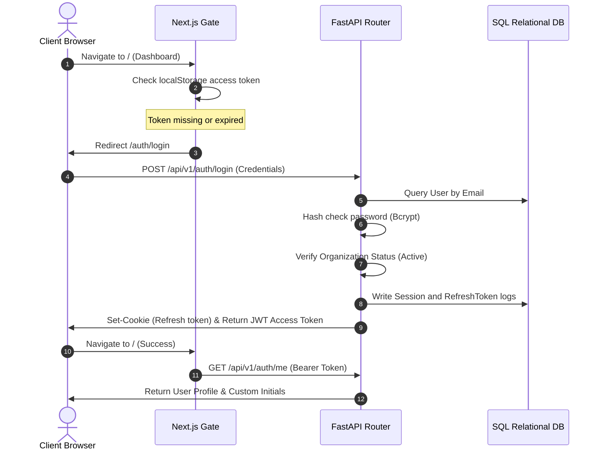

# Enterprise Authentication Architecture — AI-BOS

This document details the multi-tenant session verification and authorization systems integrated into the AI-BOS workspace.

---

## 1. Authentication Lifecycle Flow

The application executes a secure, multi-step validation cycle for every user session:

---

## 2. JWT token claims schema

Access tokens are encrypted using the standard `HS256` HMAC algorithm. The JWT payload encapsulates the following parameters to assist client routing validation without database roundtrips:

* **`sub`:** Unique user UUID string.
* **`org_id`:** Unique tenant organization ID UUID.
* **`roles`:** List of user role IDs (e.g. `["super_admin"]`).
* **`sid`:** Database session ID linking to the active token.
* **`token_id`:** Unique identifier preventing token replay attacks.
* **`exp`:** Access token expiration unix epoch (set to 60 minutes).

---

## 3. Refresh Token Rotation (RTR)

To prevent replay attacks and safeguard session persistence:
1. **Rotation:** Every `/auth/refresh` request revokes the old refresh token record (`is_revoked: True`) and issues a new, rotated refresh token alongside the new access token.
2. **Replay Detection:** If a revoked refresh token is submitted, the backend immediately flag the attempt as a potential theft and invalidates the entire parent session, forcing a complete re-authentication.

---

## 4. Protected Route Middleware

The API gateway implements authorization decorators to protect endpoints at multiple granularities:
* **Authentication Middleware:** Decodes the JWT from authorization headers and returns the active user model object.
* **Role Verification:** Restricts access using `@router.get("/admin", dependencies=[Depends(RoleChecker(["super_admin"]))])`.
* **Permission Gate:** Inspects role permission tables using `Depends(PermissionChecker("leads:write"))`.
