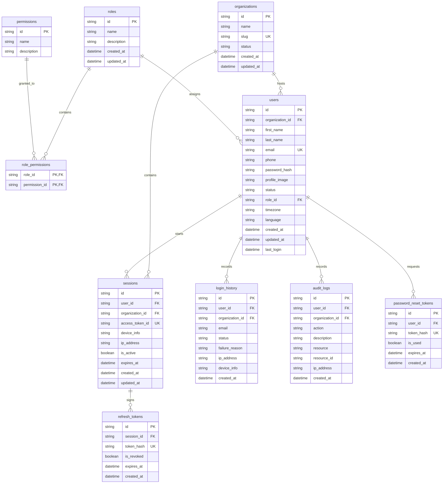

# Database Schema Manual — AI-BOS

This document details the relational entity diagrams, schema models, and data types configured for the AI-BOS Enterprise multitenancy foundation.

---

## 1. Entity Relationship Model

The relational tables map user credentials, sessions, and logs to their respective tenant organizations:

---

## 2. Seed Data Specifications

The relational schema initializes and seeds the following core values on server lifespan startup:

### Roles & Default Permissions Mappings
1. **`super_admin`:** Has `admin:all` (Full global control).
2. **`org_admin`:** Has `org:read`, `org:write`, `leads:read`, `leads:write`, `agents:read`, `agents:write` (Tenant operations controller).
3. **`manager`:** Has `leads:read`, `leads:write`, `agents:read` (CRM team managers).
4. **`sales_executive`:** Has `leads:read`, `leads:write` (Lead operations).
5. **`ai_agent`:** Has `leads:read`, `leads:write`, `agents:read` (Cognitive automations).
6. **`developer`:** Has `agents:read`, `agents:write` (Agent configs developer).
7. **`auditor`:** Has `leads:read`, `agents:read` (Security reviewer).
8. **`viewer`:** Has `leads:read` (Read-only access).

### Seeded Credentials
* **Demo Organization:** `Demo Corp` (slug: `demo`)
* **Default Super Admin:**
  - **Email:** `admin@aibios.com`
  - **Password:** `admin123`
