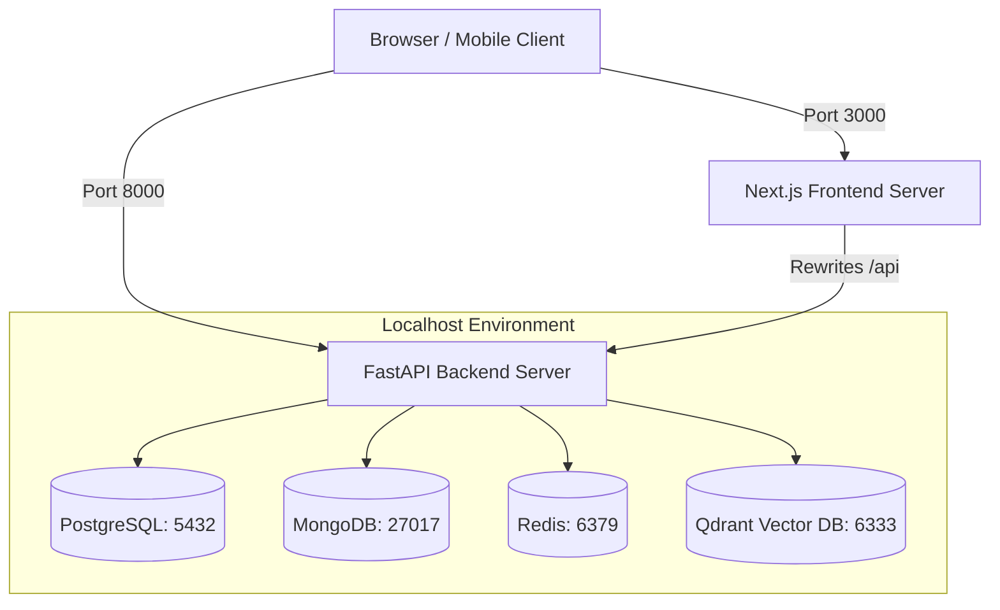
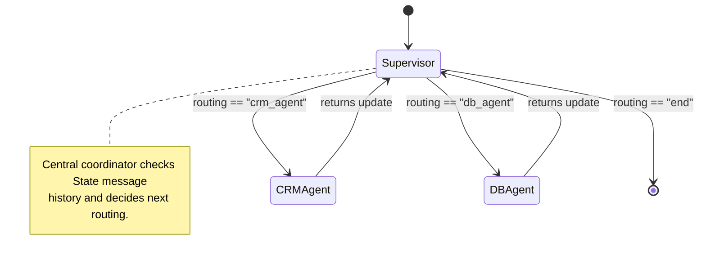

# System Architecture Blueprint — AI-BOS Enterprise

This document describes the design concepts, data paths, database layouts, and cognitive workflow topologies of the **AI Business Operating System (AI-BOS)**.

> [!NOTE]
> This architecture is locked as of Phase 0. For detailed registry and mapping blueprints, refer to:
> - [Master Architecture Blueprint](file:///d:/react-website/aibios/documentation/MASTER_BLUEPRINT.md)
> - [Module Registry](file:///d:/react-website/aibios/documentation/MODULE_REGISTRY.md)
> - [Future Phase Registry](file:///d:/react-website/aibios/documentation/PHASE_REGISTRY.md)
> - [Dependency Map](file:///d:/react-website/aibios/documentation/DEPENDENCY_MAP.md)
> - [Service Map](file:///d:/react-website/aibios/documentation/SERVICE_MAP.md)
> - [Data Flow Map](file:///d:/react-website/aibios/documentation/DATA_FLOW_MAP.md)
> - [Folder Responsibility Map](file:///d:/react-website/aibios/documentation/FOLDER_RESPONSIBILITY_MAP.md)

---

## 1. Local Routing Architecture

In local development, the **Next.js Frontend Developer Server** runs on port 3000 and the **FastAPI Backend Service** runs on port 8000. Next.js handles routing path redirection using development rewrites, forwarding `/api/*` queries directly to the backend. All operational databases run independently on their default localhost ports.

---

## 2. Polyglot Persistence Layer

Instead of forcing a single database engine to handle heterogeneous business data, AI-BOS employs a **Polyglot Persistence Model**:

| Database Engine | Primary Role | Data Characteristics |
| :--- | :--- | :--- |
| **PostgreSQL** | Transactional & Identity | High ACID compliance, strict schemas, User RBAC states, financial ledgers. |
| **MongoDB** | Telemetry & Ephemeral Records | Schema-less documents, detailed execution logs from AI agents, chat historical payloads. |
| **Redis** | Speed & Caching | Key-value store with high write speeds, active user sessions, API rate-limiting trackers, pub/sub queues. |
| **Qdrant** | Semantic Context Memory | Vector databases storing high-dimensional embeddings. Powering semantic searches and episodic agent memory. |

---

## 3. LangGraph Multi-Agent Workflows

Cognitive reasoning is structured as a **State Graph** using **LangGraph**. A centralized **Supervisor** node acts as a cognitive router, delegating tasks to dedicated agent nodes based on user intent, and evaluating agent outputs prior to completion.

---

## 4. Frontend & Mobile Design Tokens

UI/UX styling relies on **CSS Variables** defined in a centralized token sheet rather than utilities libraries. This allows seamless transitions between **Light Theme** and **Dark Theme** without compounding compilation layers.

- **Spacing:** Anchored on an 8pt modular grid (`--space-1: 4px`, `--space-2: 8px`, `--space-4: 16px`).
- **Typography:** Uses native typography scaling for high accessibility and fast load times.
- **Glassmorphism:** Leverages HSL values combined with alpha transparency (`--glass-bg`, `--glass-blur`) to create clean 2026 Enterprise SaaS designs.
