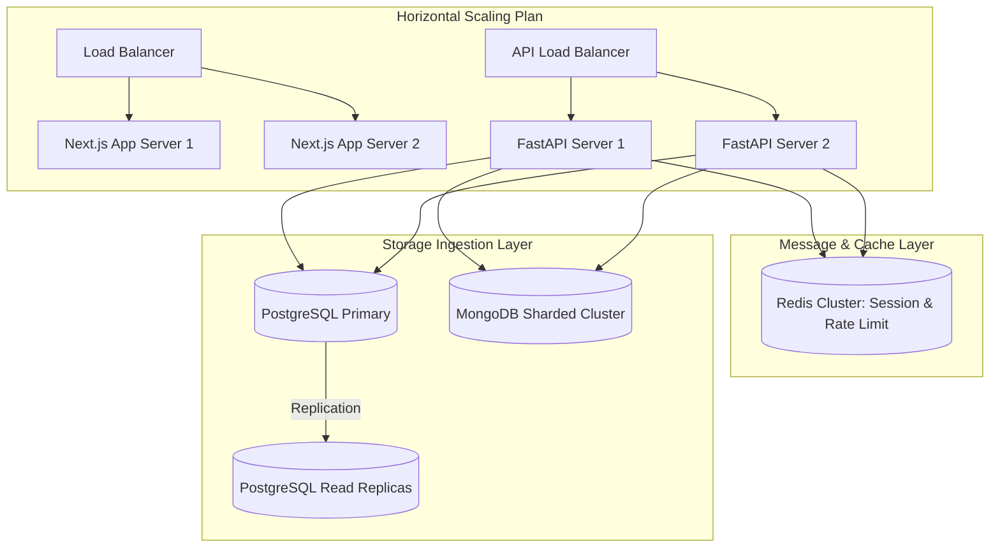

# Enterprise Master Blueprint — AI-BOS

This document constitutes the official, permanent **Master Blueprint** and architectural lock for the AI-BOS system. It defines the systems design boundaries, core invariants, scaling guidelines, and structural patterns. All subsequent phases must comply strictly with these blueprints.

---

## 1. Architectural Philosophy and Locks

AI-BOS is built on a **decoupled, modular, and extensible architecture**. Core boundaries are permanently locked to allow seamless portability across different runtime targets:
* **Local Development Mode:** Runs natively on developer hosts (Windows, Linux, macOS) without container dependencies, using direct port-to-port connections to Postgres, MongoDB, and Redis.
* **VPS Deployment Target:** Enables hosting the services (FastAPI, Next.js, and DB engines) on single virtual private servers using systemd, reverse proxies, and process managers.
* **Cloud Deployment Target:** Reserves standard compatibility for Kubernetes, serverless execution nodes, and cloud-managed databases (RDS, Atlas, ElastiCache) in production.
* **Modular Services:** All functional modules are structurally decoupled. Service logic is structured using repository patterns and service layers to ensure independent unit-testability.
* **Plugin Architecture:** Decouples core framework features from future custom integrations, allowing optional integrations (Facebook Ads, WhatsApp) to hook in via defined base interfaces.
* **AI Agent Isolation:** Isolates LangGraph state definitions and cognitive supervisors from standard HTTP request loops.

---

## 2. Infrastructure Scaling Blueprint

The system architecture supports both horizontal and vertical scaling:

### Scaling Rules
* **Stateless Application Servers:** The FastAPI backend and Next.js frontend are completely stateless. All transient session storage must reside in **Redis**.
* **Database Scaling:**
  - **PostgreSQL:** Handles ACID relational transactions. Scale vertically or horizontally via read replicas.
  - **MongoDB:** Handles high-volume unstructured logs, voice metadata, and chat transcripts. Scale via MongoDB sharding.
  - **Redis:** Handles locks, pub/sub queues, and rate-limiting. Scale via Redis Cluster.
* **Event Brokerage:** Long-running jobs (e.g. Lead processing queue, Voice AI analysis) must be queued using Redis or Celery to isolate the main API thread from latency.
